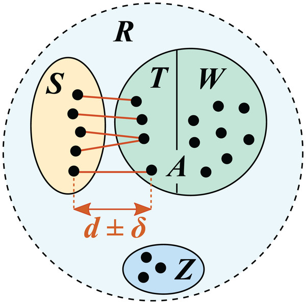

--- 
site: bookdown::bookdown_site
output: bookdown::gitbook
documentclass: book
bibliography: [book.bib]
biblio-style: apalike
link-citations: yes
github-repo: rstudio/bookdown-demo
description: ""
---
# Our dataset {-}

18 water samples collected from rivers and lakes near oil-sands extraction sites in the province of Alberta, Canada. Collected water was filtered and DNA collected on the filers was extracted and sequenced. For each sample collected, two different marker genes were used to amplify and sequence distinct DNA regions : the **12S** ribosomal RNA gene and the mitochondrial cytochrome oxidase subunit (**COI**). 

```{r, echo = FALSE, warning = FALSE}
library(DT)
primer_info_table = read.csv(file = "data/primer_table.csv", check.names = FALSE)
datatable(primer_info_table, rownames = FALSE, caption="Amplified regions details", options=list(scrollX=T, dom = 't', paging=FALSE, ordering=FALSE,
                                                            initComplete = JS("function(settings, json) {",
                                                                              "$(this.api().table().header()).css({'font-size': '10px'});",
                                                                              "}"))) %>% formatStyle(columns = colnames(.$x$data), `font-size` = '10px')
```

## Alberta fishes {-}

[Fishbase](https://www.fishbase.se/search.php) was used to generate the following list of Alberta freshwater fishes. 

```{r, echo = FALSE, warning = FALSE}
library(DT)
fishbase_alberta = read.csv(file = "data/fishbase_alberta_freswater.csv", check.names = FALSE)
datatable(fishbase_alberta, rownames = FALSE, options=list(initComplete = JS("function(settings, json) {",
                                                                              "$(this.api().table().header()).css({'font-size': '11px'});",
                                                                              "}"))) %>% formatStyle(columns = colnames(.$x$data), `font-size` = '11px')
```

## Worklfows and their associated available databases {-}

```{r, echo = FALSE, warning = FALSE}
library(DT)
workflow_database = read.csv(file = "data/workflow_databases.csv", check.names = FALSE)
datatable(workflow_database, rownames = FALSE, options=list(scrollX=T, dom = 't', paging=FALSE, ordering=FALSE,
                                                            initComplete = JS("function(settings, json) {",
                                                                              "$(this.api().table().header()).css({'font-size': '11px'});",
                                                                              "}"))) %>% formatStyle(columns = colnames(.$x$data), `font-size` = '11px')
```

**Links** 

- [1] [Barcode of life (BOLD)](https://www.boldsystems.org/)
- [2] [barque workflow](https://github.com/enormandeau/barque) 
- [3] [COI formatted for Barque](https://www.ibis.ulaval.ca/services/bioinformatique/barque_databases/)
- [4] [DADA2 workflow](https://benjjneb.github.io/dada2/ITS_workflow.html)
- [5] [Eukaryote CO1 Classifier](https://github.com/terrimporter/CO1Classifier/releases/tag/RDP-COI-v5.1.0) 
- [6] [Mitochondrial Genome Database of Fish (MitoFish)](https://mitofish.aori.u-tokyo.ac.jp/) 
- [7] [National Center for Biotechnology Information (NCBI)](https://www.ncbi.nlm.nih.gov/)
- [8] [Ribosomal Database Project (RDP) classifier](https://github.com/rdpstaff/classifier)
- [9] [VSEARCH](https://github.com/torognes/vsearch)
- [10] [12S fish Classifier v1.0.1](https://github.com/terrimporter/12SfishClassifier/releases/tag/v1.0.1)
- [11] [12S formatted for barque](https://github.com/enormandeau/barque/blob/master/03_databases/12S.fasta.gz)

### Representation of Alberta freshwater fishes in databases {-}

Original code to evaluate if the fish from Alberta were present in each of the databases ([3](https://www.ibis.ulaval.ca/services/bioinformatique/barque_databases/), [5](https://github.com/terrimporter/CO1Classifier/releases/tag/RDP-COI-v5.1.0) , [10](https://github.com/terrimporter/12SfishClassifier/releases/tag/v1.0.1), [11](https://github.com/enormandeau/barque/blob/master/03_databases/12S.fasta.gz)) can be found [here][Evaluation representation in databases]. 

```{r, echo = FALSE, message = FALSE, warning = FALSE}
#library(shiny)
library(DT)
library(dplyr)

aff_databases = read.csv(file = "data/represensation_albertafish_databases.csv", check.names = FALSE, row.names = 1)
datatable(aff_databases, rownames = FALSE, options = list(scrollX = T, dom = 't', paging=FALSE, ordering=FALSE,
                                                        initComplete = JS("function(settings, json) {",
                                                                              "$(this.api().table().header()).css({'font-size': '11px'});",
                                                                              "}"))) %>% formatStyle(columns = colnames(.$x$data), `font-size` = '11px') %>% 
  formatStyle(names(aff_databases), 
              backgroundColor = styleEqual(c("Yes","No"), c("#DeF7E9", "#ff7f7f")), 
              backgroundSize = "50%", 
              backgroundPosition = 'center')
```

## Comparing pipelines with available databases {-}

### DADA2 {-}

#### 12S {-}

#### COI {-}

839 ASV | from these 839 ASVs, 20 (2.38 %) are species with a bootstrap level above 70 % | from these 20 species, 8 (40 %) are from class actinopteri | from these 8 actinopteri, 7 (87.5 %) are species of freshwater fishes found in Alberta. 

### Barque {-}

## Curating databases {-}

https://forum.qiime2.org/t/building-a-coi-database-from-bold-references/16129

Using `seqkit` tool to filter databases in order to keep only sequences of freshwater fishes found in Alberta 

```{bash, eval = FALSE}
seqkit grep -v -n -f id_list.txt in.fasta > out.fasta
```

<!--chapter:end:index.Rmd-->

## Taxonomy cross validation by identity (TAXXI) {-}

Cross-validation by identity (CVI) models varying distances between query sequences and reference sequences. A reference with known taxonomies is split into test and training sets such that for all test sequences, the most similar training sequence has a given identity (*d*). This is repeated for different identities, enabling assessment of prediction accuracy at varying distances from the reference.

Some important definitions : 

- The *lowest common rank* (LCR) of two sequences is the lowest rank where both have the same taxon name.
- The *most probable lowest common rank* (MLR) for a pair of sequences with identity *d* is defined as the LCR with highest probability. MLRs can be summarized by giving the rank identity threshold (RIT) for each rank *r*.
- The *rank identity threshold* (RIT) for each rank *r* is defined as the minimum identity for which MLR(d) = *r*. For example, if MLR(100) = species, MLR(99) = genus, MLR(98) = genus, ... MLR(94) = genus and MLR(93) = family, then RIT(species) = 100 and RIT(genus) = 94. 
- The *top-hit identity distribution* (THID) is the distances from a reference database.



\
- *R* is the reference dataset divided into four disjoint subsets *S*, *T*, *W* and *Z*.\
- *S* is the **test set**.\
- *A* is the **training set** formed by the union of *T* and *W*.\
      - *T* is the set of top hits for sequences in *S*, which are constrained to have identities in the range *d* ± σ \
            (where σ specifies the maximum allowed deviation from the desired identity (*d*)).\
      - *W* contains reference sequences with identity < *d*; these are retained to create the largest possible training set. \
      - *Z* contains sequences which cannot be assigned to *S*, *T* or *W* without violating the identity constraint.

<br clear="left"/>

### Making a benchmark dataset{-}

The `distmx_split_identity` command from [USEARCH](https://www.drive5.com/usearch/manual/cvi.html) divides sequences into subsets such that the top-hit identity is a given value. This is used to create test-training pairs for cross-validation by identity. Input is a distance matrix created by the `calc_distmx command`. As per methods described in [Edgar (2018)](https://peerj.com/articles/4652/#p-3) maximum allowed deviation (σ) from *d* used : σ = 1% for *d* = 90% and σ = 0.5% for *d* = 99, 97 and 95%.  

Testing with available databases (barque COI [[3](https://www.ibis.ulaval.ca/services/bioinformatique/barque_databases/)], RDP COI V5.1.0 [[5](https://github.com/terrimporter/CO1Classifier/releases/tag/RDP-COI-v5.1.0)], RDP 12S [[10](https://github.com/terrimporter/12SfishClassifier/releases/tag/v1.0.1)] and barque 12S [[11](https://github.com/enormandeau/barque/blob/master/03_databases/12S.fasta.gz)]). \ 
Following code was adapted from [Donhauser *et al.* (2024)](https://doi.org/10.1016/j.ecoinf.2024.102817) and cross-validated with the [USEARCH](https://www.drive5.com/usearch/manual/cvi.html) documentation. 

Remove tab spaces in sequence name (for RDP databases specifically)
```{bash, eval = FALSE}
for i in *.fasta ; do sed -i 's/\t/;/g' $i ; done 
```

To create the distance matrix the following code was executed from a bash script called `run_distmx.sh` using nohup. 
```{bash, eval = FALSE}
for i in *.fasta ; do ~/usearch -calc_distmx $i -maxdist 0.2 -termdist 0.3 -tabbedout ${i%%.*}_distmax.txt; done
```

Notes : 
```
Issue with barque_coi : Memory limit of 32-bit process exceeded, 64-bit build required..
Size of COI databases, barque vs RDP : 

- barque_coi : 1,215,952,678
- rdp_coi :    1,708,094,361
``` 

To create training and test datasets at different % identity the following code was executed from a bash script called `run_splitid.sh` using nohup. 
```{bash, eval = FALSE}
for i in *.fasta ; do
        ~/usearch -distmx_split_identity ${i%%.*}_distmax.txt -mindist 0.025 -maxdist 0.035 -tabbedout ${i%%.*}.97.subsets.txt
        ~/usearch -distmx_split_identity ${i%%.*}_distmax.txt -mindist 0.045 -maxdist 0.055 -tabbedout ${i%%.*}.95.subsets.txt
        ~/usearch -distmx_split_identity ${i%%.*}_distmax.txt -mindist 0.095 -maxdist 0.105 -tabbedout ${i%%.*}.90.subsets.txt
done
```

Output is a tabbed text given by the -tabbedout option. Fields are:

- Col1 - `Subset name` : there are four subsets with names `1`, `2`, `1x` and `2x`.
- Col2 - `Label1` : label1 is the label of a sequence in the subset given by Col1.
- Col3 - `Label2` : label2 is the top hit in the other subset (1 or 2)
- Col4 - `Dist`   : distance between Label1 and Label2.

Subsets `1` and `2` have top hits to each other in the specified range. Subset `1x` has lower identities with subset `2`, and can therefore be added to the training set if subset `2` is the query set. Similarly, subset `2x` has lower identities with subset `1` and can be added to the training set if subset `1` is the query

```{bash, eval = FALSE}
for i in *.subsets.txt ; do awk '$1==1 || $1=="1x" {print $2}' $i > $i.trainingIDs.txt; awk '$1==2 {print $2}' $i > $i.testIDs.txt; done 
```

Create fasta file with test and training set at each identity based on list
```{bash, eval = FALSE}
for i in *.trainingIDs.txt ; do seqkit grep -n -f $i ${i%%.*}.fasta > $i.trainning.fasta ; done
for i in *.testIDs.txt ; do seqkit grep -n -f $i ${i%%.*}.fasta > $i.test.fasta ; done 
```

Renaming the files to generate shorter names in following code 
```{bash, eval = FASLE}
for file in *.trainning.fasta ; do mv $file ${file//_rdp./_rdp_} ; done
for file in *.test.fasta ; do mv $file ${file//_rdp./_rdp_} ; done
``` 

### Trainning benchmark dataset {-}

To train the newly generated training set for each identity level you need to generate a sequence file and a taxonomy file, each with special formatting requirements : 

**Sequence file**

The sequence file must be in fasta format and contain a unique identifier without any white space. The accession number makes a good identifier. Anything after the first white space is ignored. The following are acceptable:

```
>DQ248313
ACGATTTTGACCCTTCGGGGTCGATCTCCAACCCT
>JF735302 k__Fungi;p__Ascomycota;c__Sordariomycetes;o__Hypocreales;f__Nectriaceae;g__Dactylonectria;s__Dactylonectria_anthuriicol
CCGAGTTTTCAACTC
``` 

**Taxonomy file**

The taxonomy file is a tab-delimited text file beginning with a header giving the Sequence ID and names of ranks to be included, for example Domain, Phylum, Class, Order, Family, Genus, Species. The subsequent lines begin with the unique identifiers from the fasta file followed by the taxonomy for each sequence. There are two requirements for this file:

There must be an entry for every rank in every line. Hyphen placeholders are allowed but are not recommended. “Convergent evolution” is not allowed. For example, the same genus cannot appear in two different families. If a rank does not exist, you can fill in the missing entries with hyphens as in the table below. This is what the script FormatRefDB.py  in CONSTAX does, but I do not recommend doing this. Using a hyphen as a place holder leads to a “ragged” classification that cannot be properly sorted by rank. Another option is to fill in the empty spaces with made-up but meaningful ranks as in the table below. The prefixes indicate the highest rank available. The absence of hyphen placeholders means that classification will not be ragged but include all ranks. Thus it will be possible to select, sort, and merge ranks when analyzing your data later.

If you have accession IDs you can download the taxonomy from NCBI, or in some cases, as with the UNITE reference files, you can parse it from the sequence headers. In either case, some scripting is required to get everything into proper form. We definitely do not want to try typing in tens of thousands of lines without making any mistakes!

Seq_ID	Kingdom	Phylum	Class	Order	Family	Genus	Species
MG190602	Fungi	Ascomycota	Sordariomycetes	Hypocreales	o_Hypocreales	o_f_Hypocreales	Hypocreales_sp
DQ655721	Fungi	Ascomycota	Sordariomycetes	Hypocreales	Nectriaceae	f_Nectriaceae	Nectriaceae_sp
KM225681	Fungi	Ascomycota	Sordariomycetes	Hypocreales	Nectriaceae	Thyronectria	Thyronectria_lamyi
MF120484	Fungi	Ascomycota	Sordariomycetes	Hypocreales	Nectriaceae	Fusarium	Fusarium_redolens

Taxonomy format of RDP databases : 

``` 
>NC_031563	cellularOrganisms;Eukaryota;Metazoa;Chordata;Actinopteri;Cypriniformes;Cyprinidae;Aspiolucius;Aspiolucius_esocinus
``` 

Generated the following R script to parse header and generate the `ready4train_seqs.fasta` and `ready4train_taxonomy.txt`. 

<span style="color:red"> !!! To do !!! What to do in cases where only few ranks are included in the sequence header (i.e. barque) ?  !!!  </span>

Extract sequence header using grep 
```{bash, eval = FALSE} 
for i in *.trainning.fasta ; do grep -e ">" $i > ${i%%.*}_trainheader.txt ; done 
```

```{r, eval = FALSE}

``` 


<!--chapter:end:01_taxxi.Rmd-->

# Code {-}


## Evaluating representation in databases {-}

```{verbose, python}
#### ------------------------- Load libraries  ------------------------------------------------------####  

library(Biostrings)
library(tidyverse)

#### ------------------------- Load list of Freshwater fishes from Alberta ------------------------- ####  


alberta_fish = read.csv("/home/kvilleneuve/fish_edna/database/fishbase_alberta_freswater.csv", header = TRUE, check.names = FALSE)
alberta_fish$Species = gsub(" ", "_", alberta_fish$Species) # Replace space to underscore 


### ------------------------- Load the databases -------------------------------------------------- #### 


## RDP classifier ## 
rdpcoi_raw = readDNAStringSet("/home/kvilleneuve/fish_edna/database/rdp_coiv5_1_0/mydata_ref/mytrainseq.fasta", format = "fasta")
rdp12s_raw = readDNAStringSet("/home/kvilleneuve/fish_edna/database/12Sfishclassifier/mydata_training/mytrainseq.fasta", format = "fasta")

## barque ##
barquecoi_raw = readDNAStringSet("/home/kvilleneuve/fish_edna/database/bold_coi_for_barque_2023-09-12.fasta", format = "fasta")
barque12s_raw = readDNAStringSet("/home/kvilleneuve/fish_edna/database/barque_12S.fasta", format = "fasta")


### ------------------------- Parse databases dataframes  ----------------------------------------- #### 

# Because the number of ranks differ between databases used with 
# the RDP classifier and the barque workflow they are processed separately 

## RDP databases 

list_rdp_db = list("COI RDP" = rdpcoi_raw, "12S RDP" = rdp12s_raw)
list_rdp_taxa = list()
i = 0 
for (databases in list_rdp_db){
  i = i + 1
  rdp_db = as.data.frame(databases@ranges@NAMES)
  rdp_taxa = rdp_db %>% 
    separate(`databases@ranges@NAMES`, c("Domain", "Superkingdom", "Kingdom", "Phylum", "Class", "Order", "Family", "Genus", "Species"), ";")
  list_rdp_taxa[[i]] = rdp_taxa
  names(list_rdp_taxa)[i] = names(list_rdp_db[i])
}

## barque databases 

list_barque_db = list("12S barque" = barque12s_raw, "COI barque" = barquecoi_raw)
list_barque_taxa = list()
i = 0 
for (databases in list_barque_db){
  i = i + 1
  barque_db = as.data.frame(databases@ranges@NAMES) 
  barque_taxa = barque_db %>% 
    separate(`databases@ranges@NAMES`, c("Family", "Genus", "sort_species"), "_")
  barque_taxa$Species = paste(barque_taxa$Genus,"_",barque_taxa$sort_species, sep ="")
  list_barque_taxa[[i]] = barque_taxa
  names(list_barque_taxa)[i] = names(list_barque_db[i])
}

# After parsing each databases we combine them into as single list 
# then we filter out fishes which are not found in their list of Alberta freshwater fishes

jointlist_all_db = c(list_rdp_taxa, list_barque_taxa)
list_filtered_db = list()
i = 0
for (databses in jointlist_all_db){
  i = i + 1
    filtered_db = databses %>%
    filter(Species %in% unique(alberta_fish$Species))
  filtered_db_df = as.data.frame(unique(filtered_db$Species))
  names(filtered_db_df) = "Species"
  filtered_db_df[names(jointlist_all_db[i])] = "Yes"
  list_filtered_db[[i]] = filtered_db_df
}

filtered_df = Reduce(function(...) merge(..., all=T), list_filtered_db)

### ------------------------- Combine as dataframe as save output  ----------------------------------------- #### 

final_df = merge(alberta_fish, filtered_df, by = "Species", all = TRUE)
final_df = gsub("_", " ", final_df$Species)
write.csv(final_df, "/home/kvilleneuve/fish_edna/results/represensation_albertafish_databases.csv", quote = FALSE)
``` 

<!--chapter:end:02_code.Rmd-->

# Supplementary data {-}

<!--chapter:end:03_supplementary_data.Rmd-->

